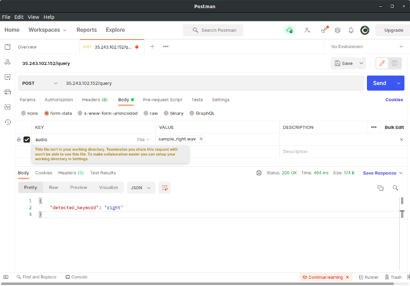

# Machine Learning Task - Keyword Spotting
ML Task which shows a proof of concept in developing a keyword spotting model

This repository contains the documentation done during experimentation as well as the jupyter notebooks for training and inference.

## I. Data Gathering

Dataset source: https://www.tensorflow.org/datasets/catalog/speech_commands

For manual inspection and preprocessing of data, I downloaded the official data splits as stated from the source code in `tfds.audio.SpeechCommands`

Official train and val set: http://download.tensorflow.org/data/speech_commands_v0.02.tar.gz

Official test set: http://download.tensorflow.org/data/speech_commands_test_set_v0.02.tar.gz

12 keywords are expected to be detected namely:

- down
- go
- left
- no
- off
- on
- right
- stop
- up
- yes
- \_silence\_
- \_unknown\_

## II. Data Preprocessing

Upon closer inspection of the data, the 12 labels used for testing are not the same as the labels for training

1. `preprocessing/unknown.py` script was used to compile all words which are not part of the 10 words into one label called '\_unknown\_'
    - only a subset of these were used to closely match the number of samples for the other labels

2. `preprocessing/split_bg.py` script was used to split the data from \'_background_noises\_' label into 1s chunks for the '\_silence\_' label
    - each sample from the other labels were 1 second wavs so there was a need to match the file size with this label
    
## III. Training

For the training script, please see `kws_training.ipynb` for the source code

It was heavily based from the tutorial in https://www.tensorflow.org/tutorials/audio/simple_audio with modifications to fit the complete and train datasets from the tf dataset speech_commands

### Notes

1. Visualizations were added to inspect the data as well as results.

2. There's already a trained model available so no need to run this to get a model.

## IV. Test Data Evaluation and Inference

For data evaluation and inference, please see `kws_eval_inference.ipynb`

### Notes

1. Just run the whole notebook to simulate the evaluation and inference with the model.

2. Part of the setup already includes downloading the test data and the trained model so you just need to run the cell.

## V. API Inference 

I also deployed an api through GCP Kubernetes to allow you to send in your requests without having to setup anything.

To access this, here are the steps:

1. Use an application to send in POST requests e.g. Postman

2. Enter this request URL `35.243.102.152/query`

3. Click on Body > form-data

4. Hover over the "key" cell and choose "file"

5. Add the ff. values

    - key: audio 
    - value: \<upload your audio file here\>

6. If you're using postman, it should look like this

7. Click send to send in your request to the API

## VI. Experiments Documentation

Google Colab was utilized to run training and inference for the entire experimentation.

| # of Training Data Samples | Epochs  | Batch Size | Accuracy on Full Test Data |
| :--------------------------|:--------|:-----------|:---------------------------|
| 16,000                     | 30      | 64         | 89%                        |
| 16,000                     | 35      | 64         | 90%                        |
| 24,000                     | 35      | 64         | 91.45%                     |
| **24,000**                 | **45**  | **64**     | **91.60%**                 |
| 24,000                     | 50      | 64         | 91.17%                     |

## VII. References

TensorFlow Audio Recognition - https://www.tensorflow.org/tutorials/audio/simple_audio

Keyword Spotting Implementations - https://paperswithcode.com/paper/keyword-transformer-a-self-attention-model

